# Hypothesis 1: Background Context Dependency

sketch + matte를 braid_2534로 고정하고, background만 변경했을 때 헤어 생성 결과.

---

## 실험 원리

### 입력 구성

hair 영역 $( m = 1 )$을 검정(0)으로 마스킹하여, 얼굴+배경만 보이는 background를 생성:

$$
\text{bg} = I_{tgt} \cdot (1 - m)
$$

sketch와 matte는 `ref_id` (braid_2534 등) 것으로 **완전 고정**.  
background만 다른 사람의 얼굴로 교체하여, DiT의 global attention이 얼굴 픽셀을 읽고 hair 생성에 반영하는지 검증.

### 추론 흐름 (denoising loop)

```
background ──VAE encode──▶ z_bg  (clean latent, 64×64)
sketch      ──VAE encode──▶ sketch_latent
matte       ──MatteCNN──▶  matte_feat
ctrl_cond = [sketch_latent + matte_feat,  matte_latent]  # [B,17,64,64]

z = randn(...)   # 순수 노이즈로 시작

for t in timesteps:
    residuals_cond    = ControlNet(z, ctrl_cond)
    blended           = matte_gated_blend(residuals_cond, matte_tokens)
    noise_pred_cond   = Transformer(z, blended)
    noise_pred_uncond = Transformer(z, zeros)          # CFG: 제로 residuals

    [CFG]  →  z = scheduler.step(noise_pred, t, z)
    [Compositor]  →  z = composite(z, z_bg, matte, sigma)
```

**CFG** (Classifier-Free Guidance):

$$
\hat{v} = v_{uncond} + w \cdot (v_{cond} - v_{uncond})
$$

**Compositor** — 매 스텝 배경 복원:

Flow Matching 공식으로 현재 $\sigma$ 수준에 맞게 배경 latent를 noising:

$$
z_{bg}^{(\sigma)} = (1 - \sigma)\, z_{bg} + \sigma\, \varepsilon, \quad \varepsilon \sim \mathcal{N}(0, I)
$$

Soft Matte: $\sigma$가 작아질수록(클린에 가까울수록) blur 반경 증가:

$$
r = \lfloor (1 - \sigma) \cdot r_{max} \rfloor, \qquad \tilde{m} = \text{GaussianBlur}(m,\, r)
$$

최종 합성:

$$
z_{out} = z_{pred} \cdot \tilde{m} \;+\; z_{bg}^{(\sigma)} \cdot (1 - \tilde{m})
$$

**Compositor의 역할**:  
- **hair 영역** $(\tilde{m} \approx 1)$: DiT가 예측한 latent 유지 → 헤어 자유 생성  
- **non-hair 영역** $(\tilde{m} \approx 0)$: $z_{bg}$를 현재 $\sigma$ 수준으로 noising 후 덮어씌움 → 얼굴/배경을 원본 픽셀로 보존  
- **경계 soft blur**: $\sigma \to 0$ 일수록 $\tilde{m}$에 Gaussian blur 적용 → 경계 artifact 방지

### 출력 추출

$$
I_{hair} = I_{result} \cdot m
$$

변경되는 것은 `background`(=얼굴 픽셀)뿐이고, sketch/matte/seed/compositor 파라미터는 동일하므로  
결과 차이가 있다면 DiT global attention이 **배경(얼굴)을 hair 생성에 반영**하고 있다는 증거.

---

## Affine Transform 시각화

sketch와 matte의 공간적 불일치를 보정하기 위해, **braid_2534의 sketch를 braid_2572의 matte에 맞춰 Affine Transform을 적용**하였다.  
구체적으로, braid_2572의 matte에서 추출한 헤어 영역 경계를 기준으로 braid_2534의 sketch를 정렬(translation · scale · rotation)하여, 두 입력의 공간 좌표계를 통일하였다.

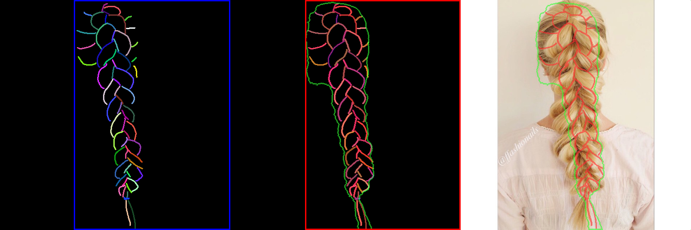

---

## 생성 결과

braid_2534의 sketch를 braid_2572의 matte에 Affine Transform으로 정렬한 뒤, 해당 조합(sketch: braid_2534 → affine-aligned, matte: braid_2572)을 입력으로 헤어를 생성하였다.

| 원본 | Full | Hair Only |
|:-:|:-:|:-:|
| braid_2534 (baseline) | | |
|  | 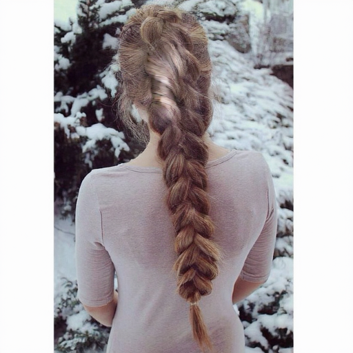 | 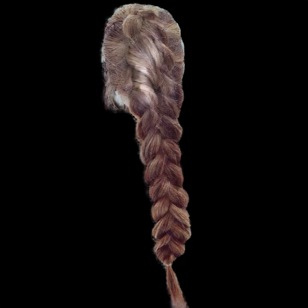 |
| braid_2572 | | |
|  | 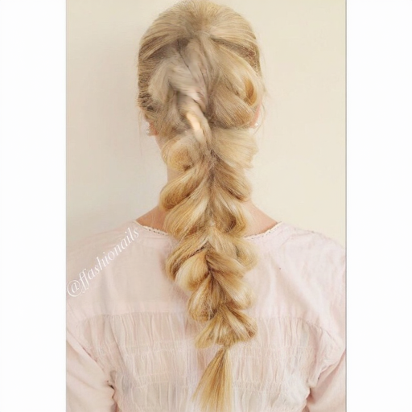 | 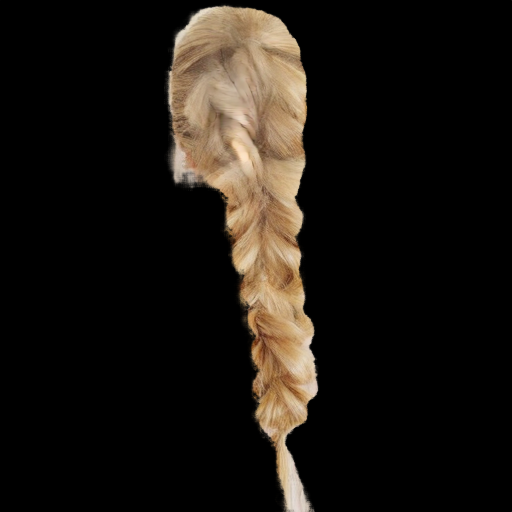 |

---

## 나노바나나 표정 실험

동일 인물의 표정(무표정/웃음/슬픔)만 바꿨을 때 헤어 생성 결과.
sketch + matte 고정, background = 나노바나나 생성 이미지.

### braid_2537

| 표정 | 원본 (나노바나나) | Full | Hair Only |
|:-:|:-:|:-:|:-:|
| 무표정 (baseline) |  | 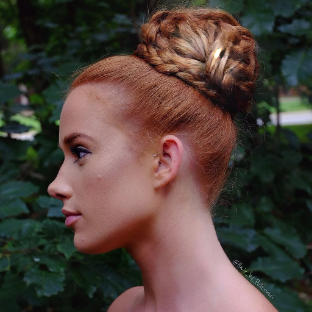 |  |
| 웃는 얼굴 |  | 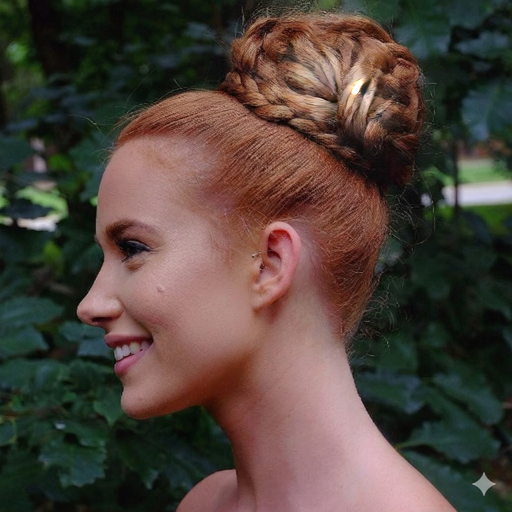 | 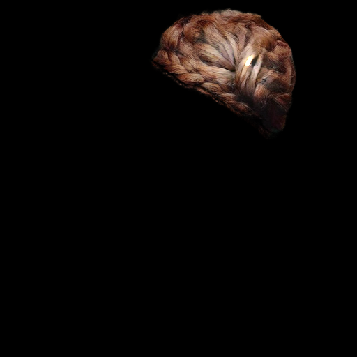 |
| 슬픈 얼굴 |  | 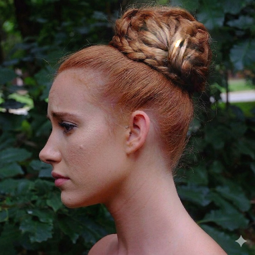 | 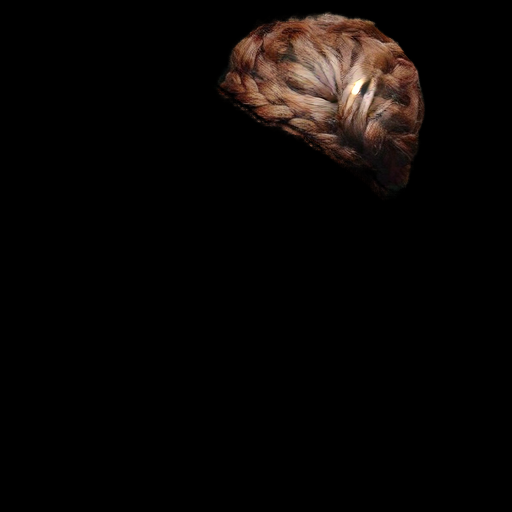 |

### braid_2562

| 표정 | 원본 | Full | Hair Only |
|:-:|:-:|:-:|:-:|
| 무표정 (baseline) |  | 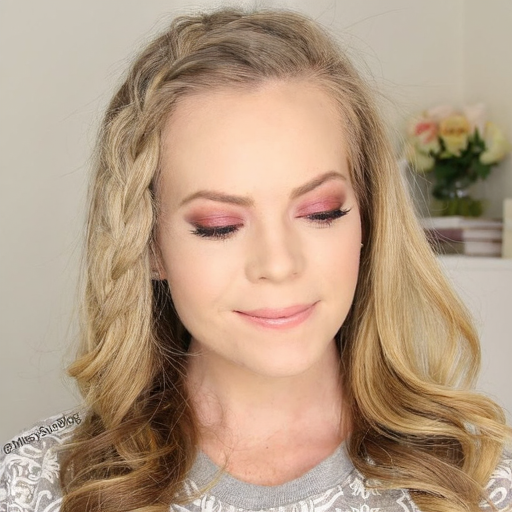 | 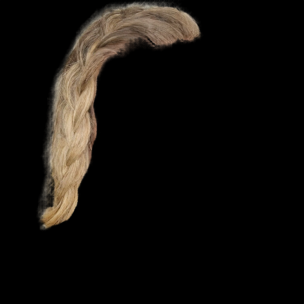 |
| 웃는 얼굴 |  | 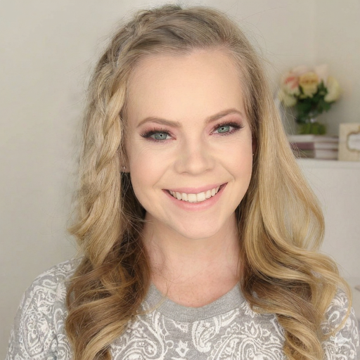 | 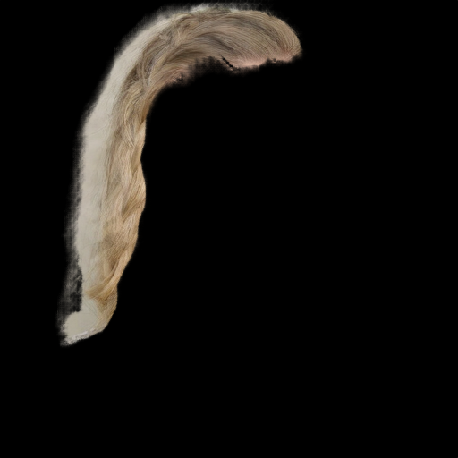 |
| 슬픈 얼굴 |  | 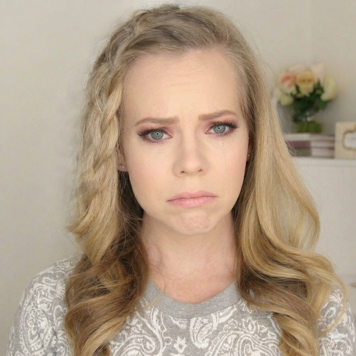 | 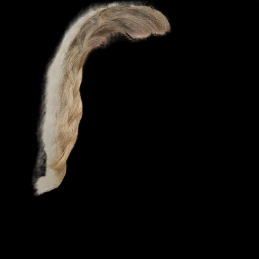 |

---

# Hypothesis 2: Background Context Dependency

sketch + matte를 각 인물 본인 것으로 고정하고, **non-hair 배경만 3가지로 교체**했을 때 헤어 생성이 달라지는지 검증.

## 실험 원리

hair 영역은 원본 픽셀을 유지하고, non-hair 영역만 교체:

$$
\text{bg} = I_{face} \cdot m \;+\; I_{new} \cdot (1 - m)
$$

모델은 이 background를 VAE로 인코딩해 $z_{bg}$를 만들고, compositor가 $m = 0$ 영역을 $z_{bg}$로 복원.  
DiT의 global attention이 non-hair 배경 픽셀까지 읽어 hair 생성에 반영하는지가 핵심.

## 실험 설계

| 조건 | non-hair 영역 | hair 영역 |
|:-:|:-:|:-:|
| `white_bg` | 흰색 (255,255,255) | 원본 유지 |
| `texture_bg` | 8×8 체커보드 (회색) | 원본 유지 |
| `complex_bg` | braid_2572 픽셀 | 원본 유지 |

## 결과

### braid_2534

| 배경 조건 | 입력 배경 | 생성 결과 |
|:-:|:-:|:-:|
| white_bg | 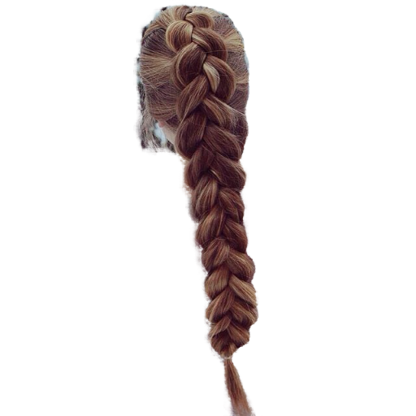 | 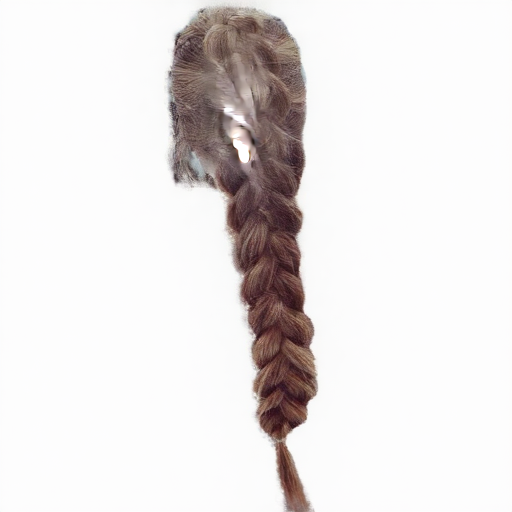 |
| texture_bg | 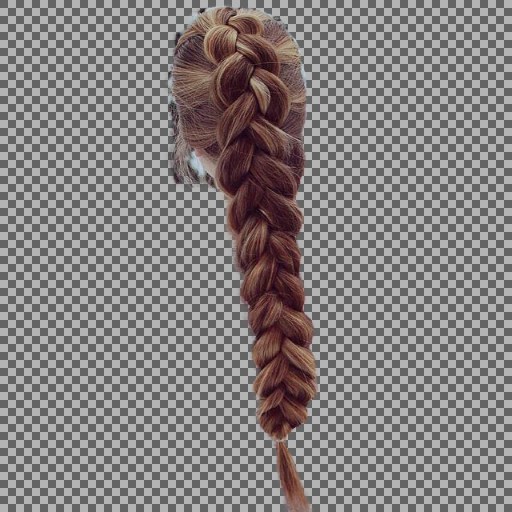 | 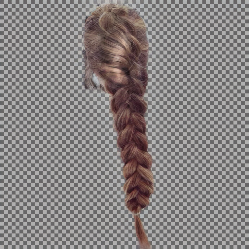 |
| complex_bg | 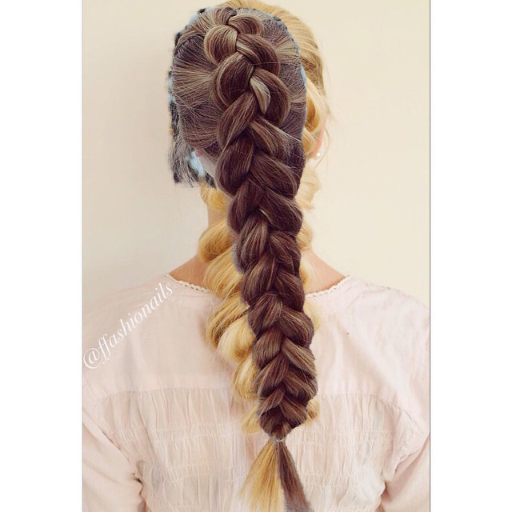 | 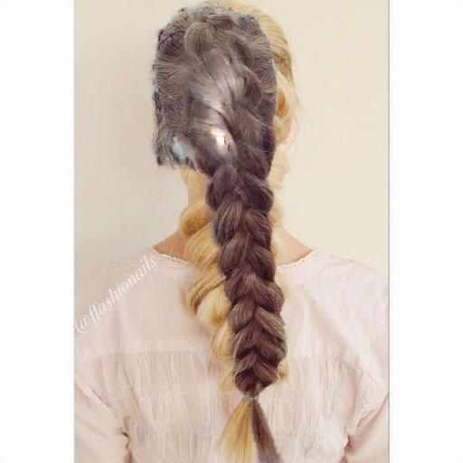 |

### braid_2562

| 배경 조건 | 입력 배경 | 생성 결과 |
|:-:|:-:|:-:|
| white_bg | 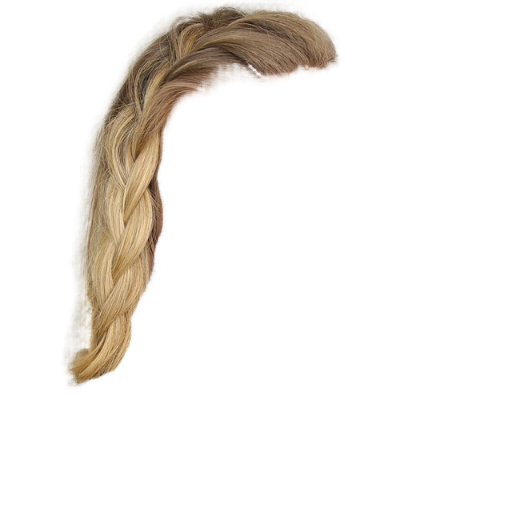 |  |
| texture_bg | 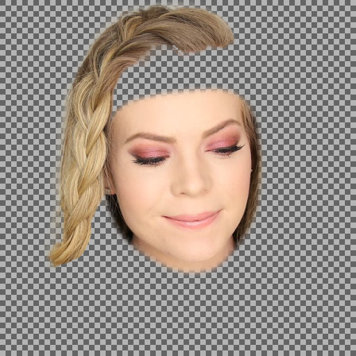 | 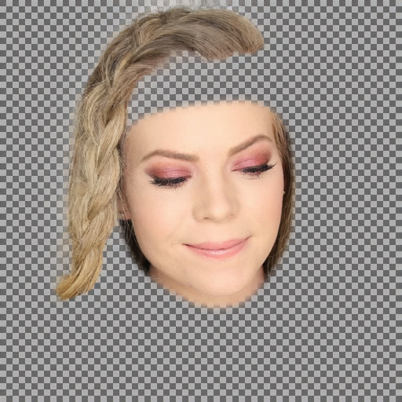 |
| complex_bg | 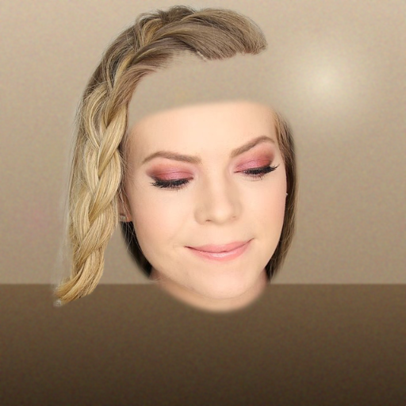 | 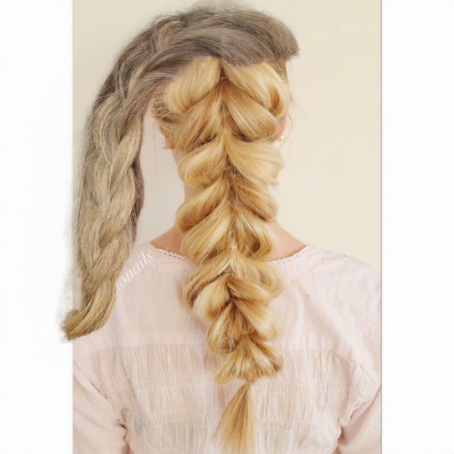 |

### braid_2574

| 배경 조건 | 입력 배경 | 생성 결과 |
|:-:|:-:|:-:|
| white_bg | 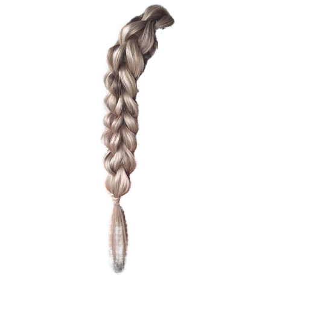 |  |
| texture_bg | 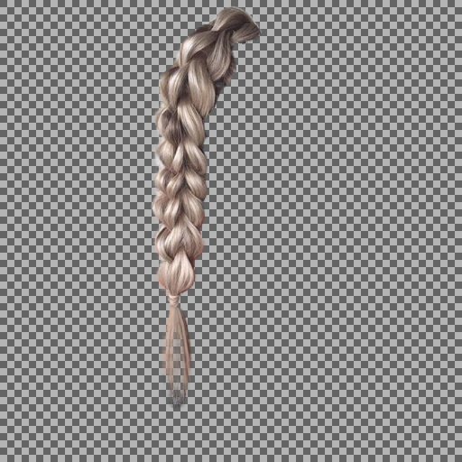 | 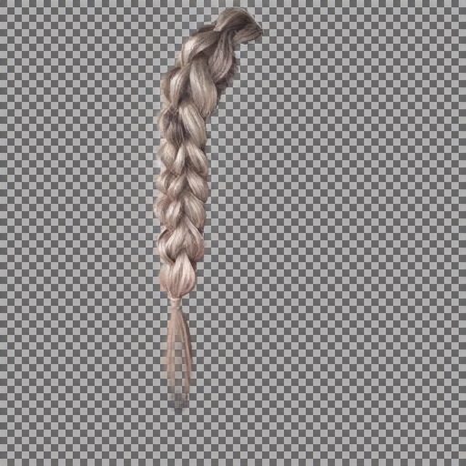 |
| complex_bg | 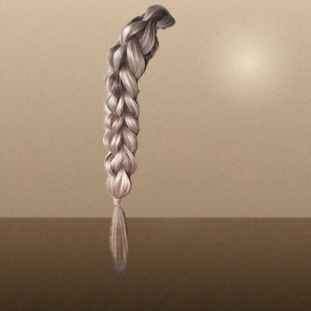 | 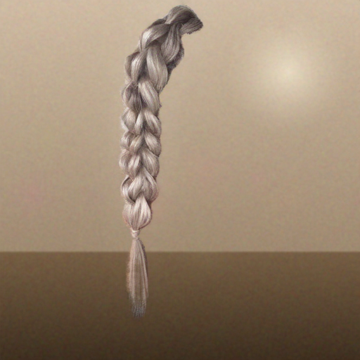 |

### braid_2653

| 배경 조건 | 입력 배경 | 생성 결과 |
|:-:|:-:|:-:|
| white_bg | 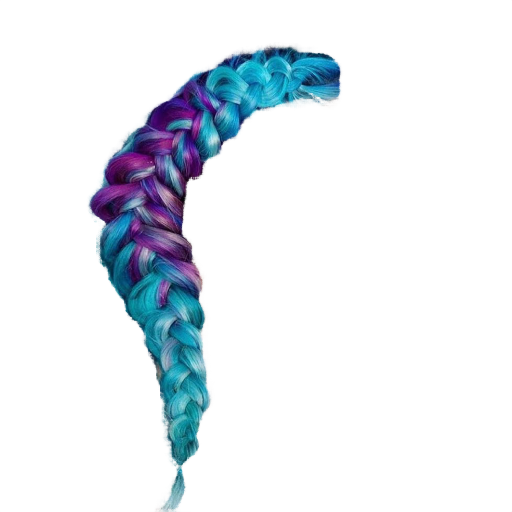 | 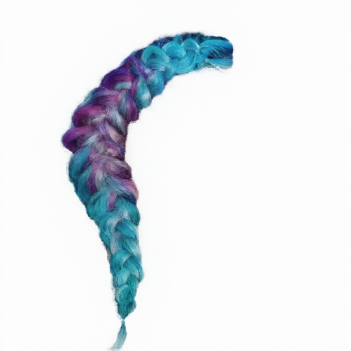 |
| texture_bg | 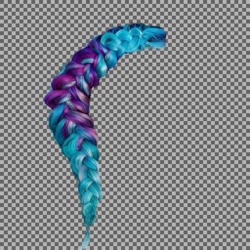 | 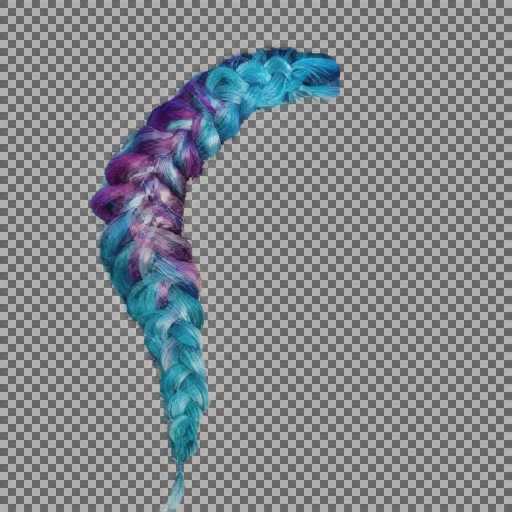 |
| complex_bg | 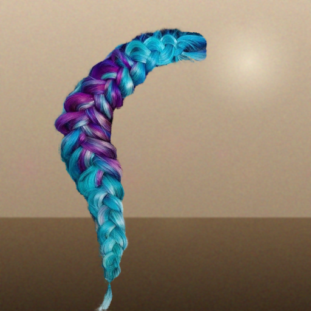 | 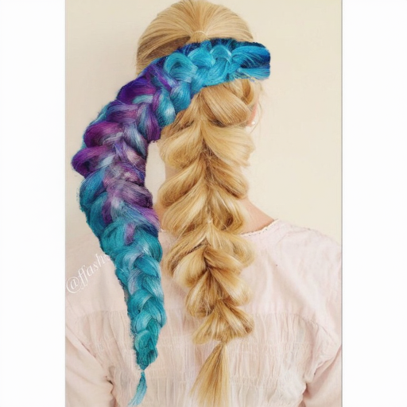 |
