# 최신 아키텍처 정리 (2026-04-14)

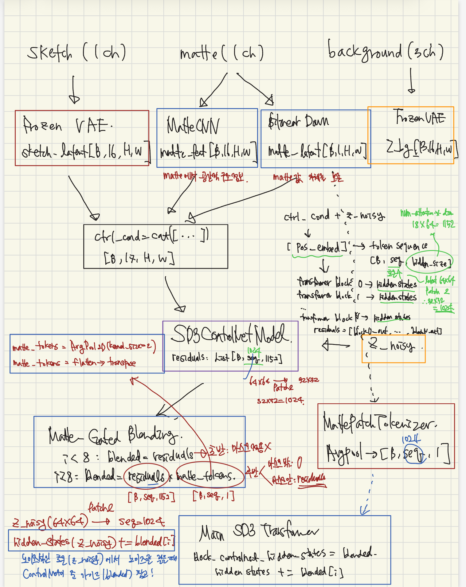

---

## 추론 결과 (checkpoint: outputs/phase2/final2, EMA)

| stem | 원본 | sketch | SketchHairSalon | Ours|
|:----:|:----:|:------:|:---------------:|:----------:|
| braid_2548 | 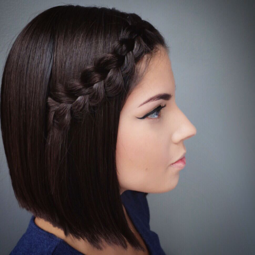 |  | 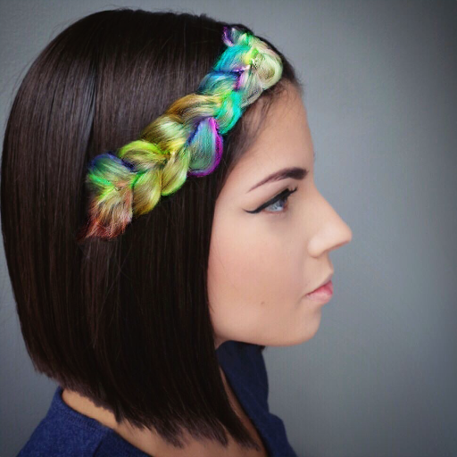 | 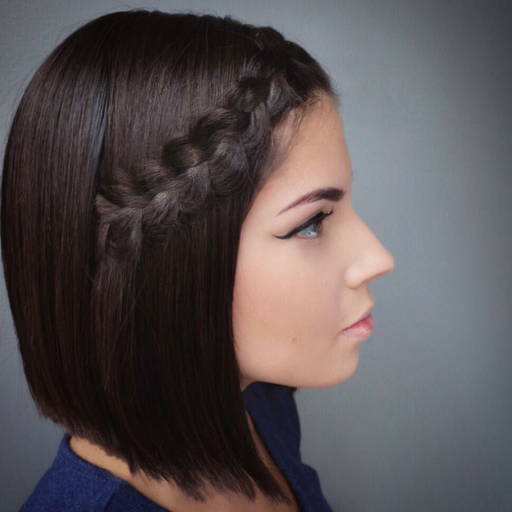 |
| braid_2562 | 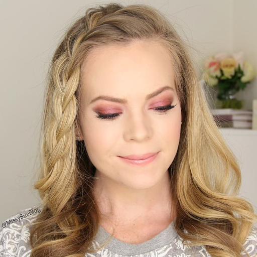 |  | 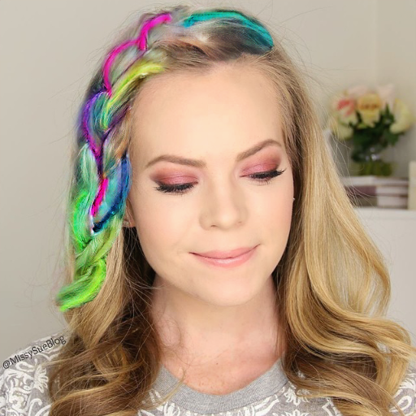 | 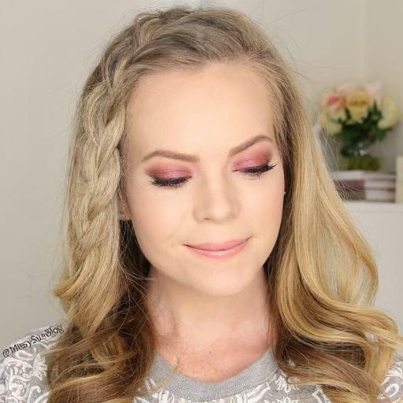 |
| braid_2574 | 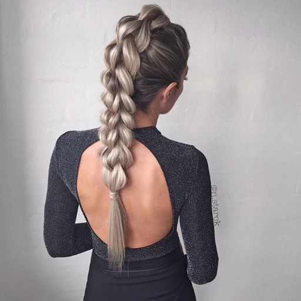 |  | 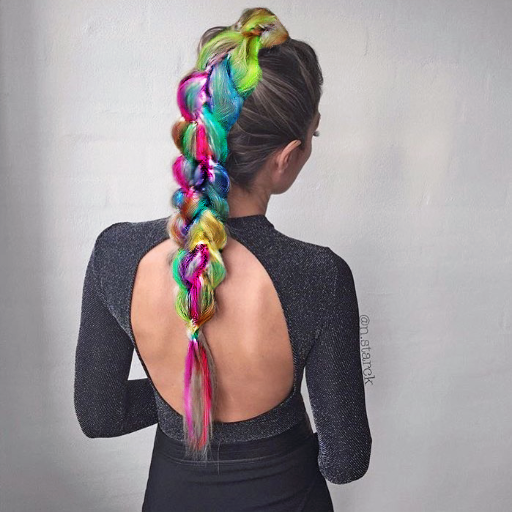 |  |
| braid_2590 | 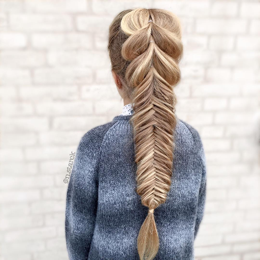 |  | 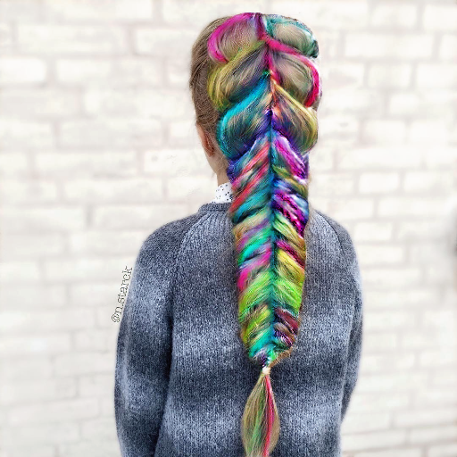 | 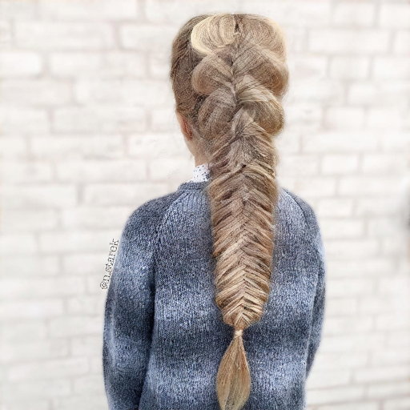 |
| braid_2592 | 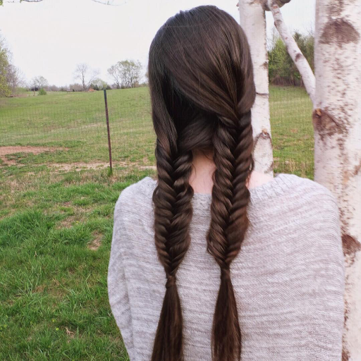 | 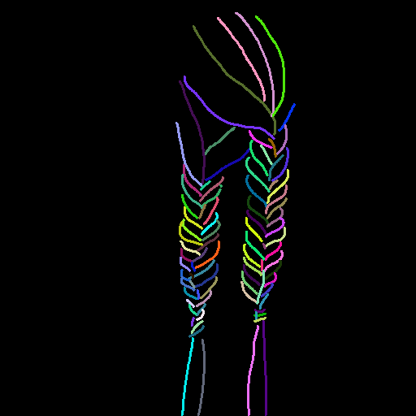 | 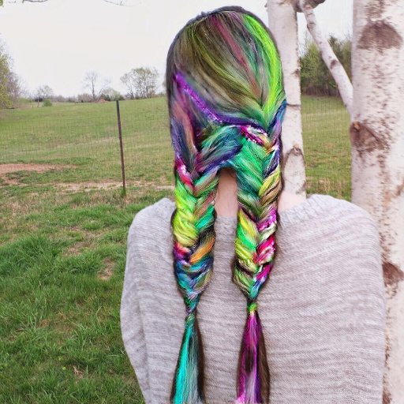 | 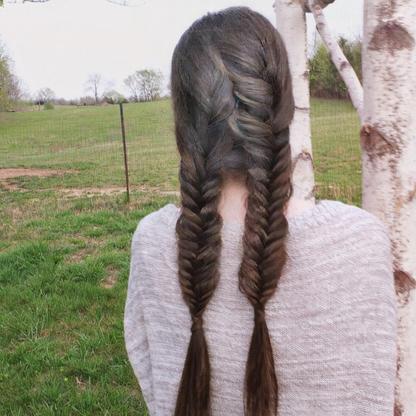 |
| braid_2617 | 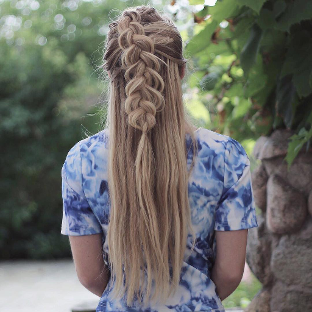 |  | 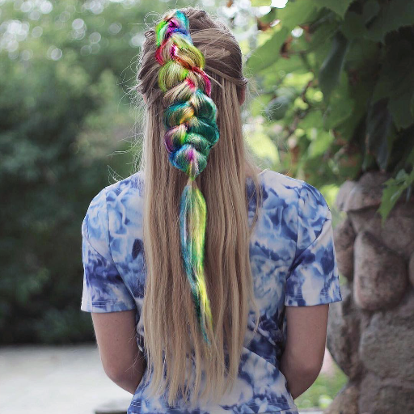 |  |
| braid_2625 | 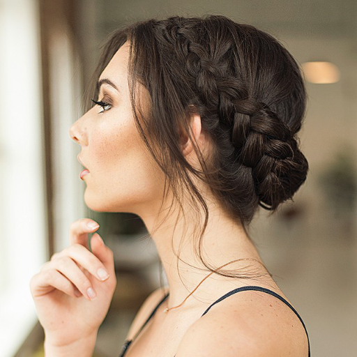 | 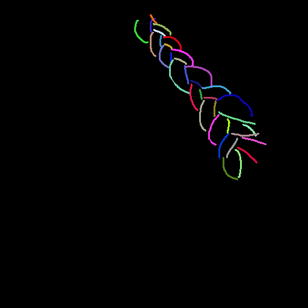 | 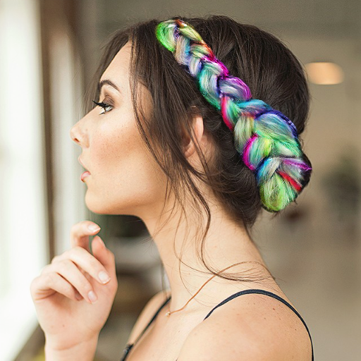 | 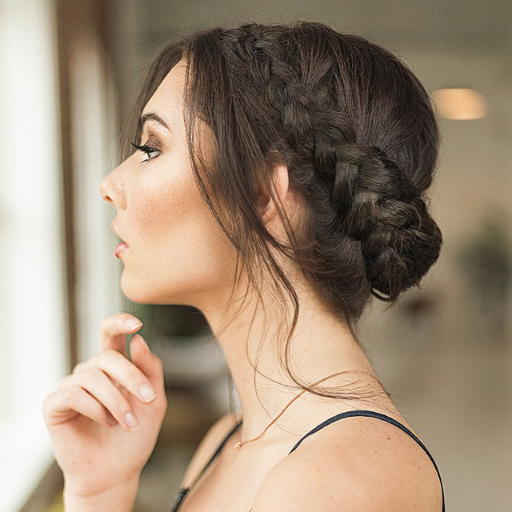 |
| braid_2652 | 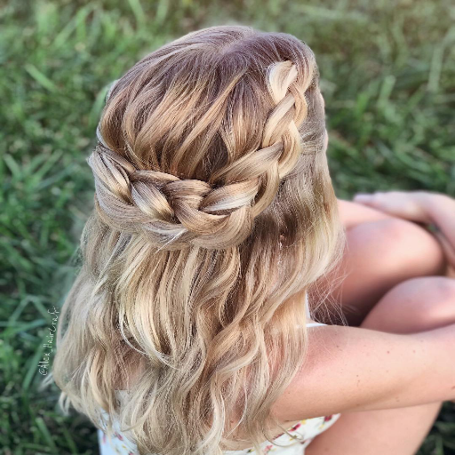 |  | 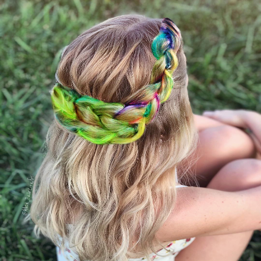 | 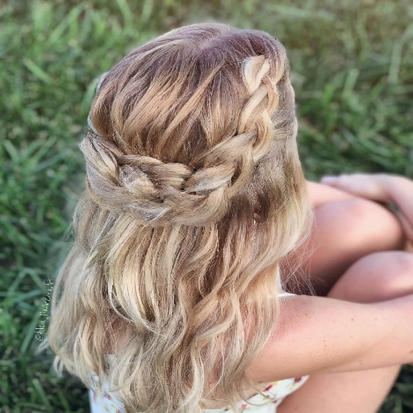 |

---

## 전체 흐름 요약

```
[background] ──VAE encode──▶ z_bg          [B,16,64,64]  (clean latent)
[sketch]     ──VAE encode──▶ sketch_latent [B,16,64,64]  (frozen VAE)
[matte]      ──MatteCNN───▶ matte_feat    [B,16,64,64]  (trainable)
[matte]      ──bilinear──▶  matte_latent  [B, 1,64,64]

ctrl_cond = cat([sketch_latent + matte_feat, matte_latent])  → [B,17,64,64]

z = randn(...)   ← 순수 노이즈로 시작

for t in timesteps (28 steps):
    residuals_cond    = ControlNet(z, ctrl_cond)
    blended           = matte_gated_blend(residuals_cond, matte_tokens)
    noise_pred_cond   = Transformer(z, blended)
    noise_pred_uncond = Transformer(z, zeros)      ← CFG: zero residuals
    noise_pred        = uncond + scale * (cond - uncond)  + rescaled CFG
    z                 = scheduler.step(noise_pred, t, z)
    z                 = Compositor(z, z_bg, matte_latent, sigma)  ← 배경 복원

z ──VAE decode──▶ 최종 이미지
```

---

## 1. ctrl_cond 구성

ctrl_cond는 ControlNet에 들어가는 17채널

### 구성 요소

| 텐서 | 생성 방법 | shape |
|---|---|---|
| `sketch_latent` | 컬러 스케치(RGB) → Frozen VAE encode → `(x - shift) * scale` | `[B,16,64,64]` |
| `matte_feat` | 소프트 알파 matte → **MatteCNN** (학습 대상) | `[B,16,64,64]` |
| `matte_latent` | matte → bilinear interpolation (64×64) | `[B,1,64,64]` |

### 합산 방식

```python
ctrl_cond = cat([sketch_latent + matte_feat,  matte_latent], dim=1)
# 결과: [B, 17, 64, 64]
```

- `sketch_latent + matte_feat`: element-wise 덧셈 (feature 공간에서 두 정보 융합)
- `matte_latent`: 마지막 1채널로 concat → ControlNet의 `extra_conditioning_channels=1`

### MatteCNN 구조

```
matte [B,1,H,W]
    Conv(1→32, stride=2) → SiLU   : H/2
    Conv(32→64, stride=2) → SiLU  : H/4
    Conv(64→16, stride=2)          : H/8 = 64×64  ← Zero-init, SiLU 없음
```

**Zero-init 의미**: 학습 초기에 `matte_feat ≈ 0` → `ctrl_cond =[sketch_latent, matte_latent]` → 사전학습 분포에서 안정적으로 시작.

---

## 2. ControlNet + Feature-Level Matte-Gated Blending

### ControlNet

- `SD3ControlNetModel.from_transformer(transformer, num_layers=12)`
- `extra_conditioning_channels=1` → `pos_embed_input: Linear(17, inner_dim)` (Zero-init)
- 12개 블록에서 residuals 추출: `List[Tensor[B, 1024, 1152]]`

### Matte-Gated Blending

```python
blend_start = int(len(residuals) * 0.5)  # = 6  (len(residuals)=12, 50%)

for i, r in enumerate(residuals):
    if i < blend_start:
        blended[i] = r                  # 앞 개:6 전체 residual (global 구조)
    else:
        blended[i] = r * matte_tokens  # 뒤 6개: matte soft gate (hair 영역만)
```

- **full residuals** (앞 6개): 1024개 token 전부에 ControlNet 신호가 실림 → 헤어 전체 윤곽·형태 결정
- **matte gating** (뒤 6개): `residuals × matte_tokens` → 헤어 token(=1)은 유지, 배경 token(=0)은 차단


`matte_tokens`: `matte_latent [B,1,64,64]` → `MattePatchTokenizer` → `[B,1024,1]`  
`broadcast`: `[B,1024,1152] * [B,1024,1]` → 헤어 영역만 선택적으로 ControlNet 신호 적용

SD3.5의 self-attention은 전체 1024 token을 서로 참조한다. 초반부터 헤어 token에만 residuals를 주면, attention을 통해 배경 token의 정보를 참조할 때 헤어-배경 경계의 global context가 약해진다. 헤어가 배경과 어떻게 이어지는지, 전체 이미지 안에서 어느 위치에 있는지를 모델이 파악하지 못하게 된다.

```
앞 6개 블록: residuals가 배경 token에도 전달됨
             → 이미지 전체 맥락 안에서 헤어의 global 구조 형성

뒤 6개 블록: 배경 token residuals = 0
             → 헤어 영역만 정밀하게 채우고, 배경은 건드리지 않기
```


## 3. Background / Hair 합성: TimestepAwareLatentCompositor

매 denoising step 직후 배경 복원. 학습 파라미터 없음

### z_pred란?

`scheduler.step()` 직후의 latent. Transformer가 이번 스텝에서 만들어낸 결과물.

```python
z = scheduler.step(noise_pred, t, z).prev_sample   # ← z_pred
z = compositor(z, z_bg, mt_latent, sigma)
```

Flow Matching 관점:


```
z_noisy   : 현재 스텝의 노이즈 낀 latent
noise_pred: Transformer가 예측한 flow 방향 (noise - z_clean 방향)
                ↓  
z_pred    : 노이즈가 한 스텝 제거된 latent (σ가 조금 작아진 상태)
```

아직 클린하지 않고 현재 sigma 수준에 맞게 노이즈가 남아있는 상태.  
Compositor는 이 `z_pred`에서 **헤어 영역만 살리고**, 배경 영역은 버리고 `z_bg^(σ)`로 교체한다.

### 합성 공식

$\tilde{m}$: 원본 matte $m$에 Gaussian blur를 적용한 soft matte.


$$
z_{out} = z_{pred} \cdot \tilde{m} + z_{bg}^{(\sigma)} \cdot (1 - \tilde{m})
$$


| 영역 | 처리 |
|---|---|
| **헤어 영역** | DiT 예측 latent 유지 → 자유 헤어 생성 |
| **비헤어 영역** | $z_{bg}^{(\sigma)}$로 덮어씌움 → 원본 배경/얼굴 보존 |

### 배경 noising

$$
z_{bg}^{(\sigma)} = (1 - \sigma) \cdot z_{bg} + \sigma \cdot \varepsilon_{bg}
$$

- `noise_mode="fixed"`: $\varepsilon_{bg}$를 루프 전에 한 번 생성해 재사용 → 배경 trajectory 일관성
- `noise_mode="random"`: 매 스텝 새 noise → artifact 패턴 고착 방지


---

## 5. 학습 대상 (Trainable Parameters)

| 모듈 | 학습 여부 | 비고 |
|---|---|---|
| `vae` |  Frozen | 메모리 절약 (tiling/slicing 활성화) |
| `transformer` (MM-DiT) | Frozen | Phase 1/2 공통 |
| `sd3_controlnet` | ✅ | ControlNet 12 layers |
| `matte_cnn` | ✅ | Zero-init → 안정적 시작 |
| `null_encoder_hidden_states` | ✅ | `[1,333,4096]` Learned Null Embedding |
| `null_pooled_projections` | ✅ | `[1,2048]` Learned Null Embedding |

---

## 6. 손실 함수

$$
L_{total} = L_{flow} + \lambda_{bg} \cdot L_{bg} + \lambda_{lpips} \cdot L_{lpips} + \lambda_{edge} \cdot L_{edge}
$$

| 손실 | 가중치 (Phase1) | 가중치 (Phase2) | 설명 | Phase |
|---|---|---|---|---|
| $L_{flow}$ | 1.0 | 1.0 | Flow Matching masked MSE (헤어=1.0, 배경=0.1 가중치) | 1+2 |
| $L_{bg}$ | 3.0 | 3.0 | 배경 latent L2 보존 | 1+2 |
| $L_{lpips}$ | 0.1 | **0.2** | LPIPS 지각 손실 (VGG), 헤어 영역만 | Phase1: step 30% 이후 / Phase2: 항상 |
| $L_{edge}$ | 0.05 | **0.15** | Sobel edge 정합 — sketch stroke 있는데 edge 없으면 패널티 | Phase2만 |

---

## 7. 데이터 Augmentation

`HairRegionDataset.__getitem__` → `build_augmentation_pipeline()` 순서대로 적용.

### 0. Horizontal Flip (Dataset 레벨)

```python
p=0.5: background, sketch, matte, target 동시 수평 반전
```

sketch-matte 공간 일관성 유지를 위해 4개 텐서를 동시에 flip.

### 1. StrokeColorSampler ~~(p=1.0)~~ → **(p=0.0, 재학습 예정)**

스케치의 각 색상 stroke에 대해 실제 헤어 픽셀에서 색상을 재샘플링.

```
sketch의 unique color C에 해당하는 픽셀 위치에서
  target 이미지의 대응 헤어 픽셀 추출
  → 33% 확률: 머리 랜덤 1픽셀 색상으로 교체
  → 67% 확률: 영역 내 헤어 픽셀 평균 색상으로 교체

색상 양자화: 5bit (32단계)로 묶어 stroke 단위 처리
```

**기존 (p=1.0)**: stroke 색을 항상 실제 헤어 색으로 교체 → 모델이 sketch 색 신호를 무시하고 학습 데이터 헤어 색 prior에서 생성. inference 시 stroke 색 미반영.

**변경 (p=0.0)**: stroke 색 교체 비활성화 → 모델이 sketch 색을 그대로 학습 → inference 시 stroke 색을 출력에 반영. 재학습 후 적용 예정. (구현 예정)

### 2. ThicknessJitter (p=0.5)

```python
kernel size ∈ {3, 5, ..., max_kernel=3}  (현재 max_kernel=3이므로 3×3만)
KM.dilation(sketch, kernel)  → 스트로크 팽창
```

**목적**: 스케치 선 굵기 변화에 대한 robustness.

### 3. MatteBoundaryPerturbation (p=0.3)

```python
noise [1,2,H,W] = randn * amplitude(4.0)
→ Gaussian blur (sigma=10.0) → smooth displacement field
→ grid_sample로 matte, target, background 동시 elastic warping
```

**목적**: matte 경계가 완벽하지 않아도 학습 가능하도록. `matte / target / background` 3개 동시 warping으로 공간 정합 유지.

---

## 8. 데이터셋 입력 구성 (HairRegionDataset)

```python
background = img * (1 - matte)      # 원본 이미지에서 헤어 영역 제거 → 배경만 남김
target     = tgt_img * tgt_matte    # 목표 헤어 이미지 × 헤어 마스크 → 헤어 영역만
```

모델은 `background` (헤어 없는 입력) + `sketch` + `matte` → `target` (헤어 영역)을 생성하는 것을 학습.

---

