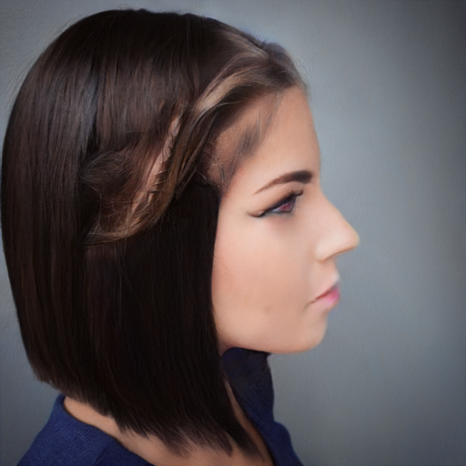
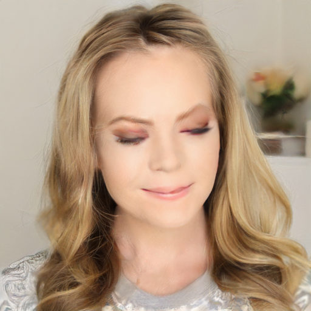
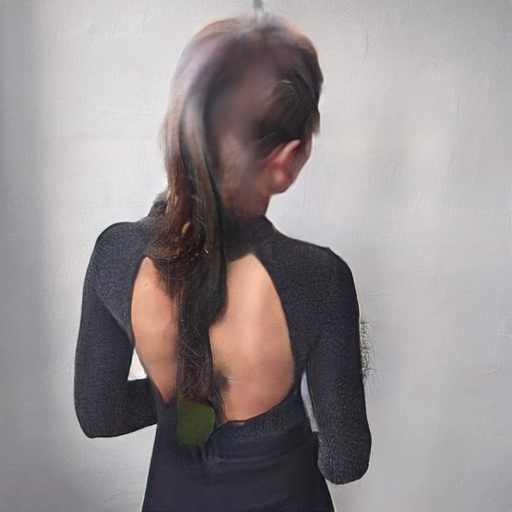
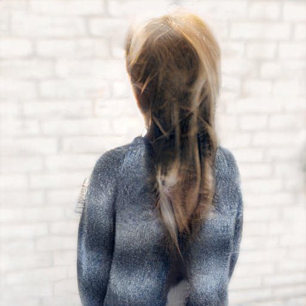
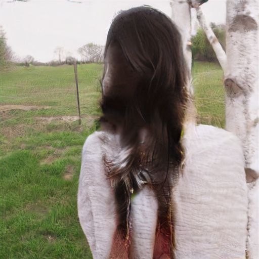
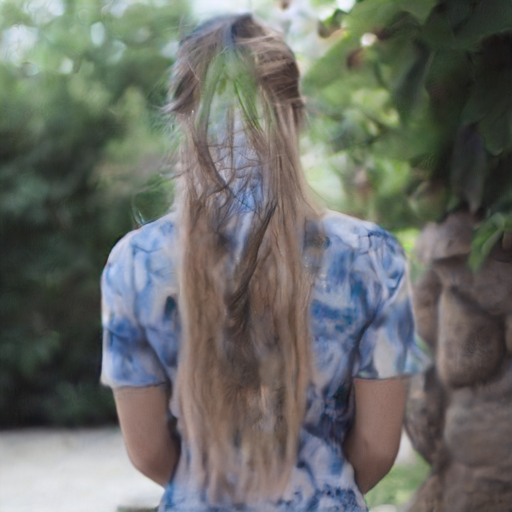
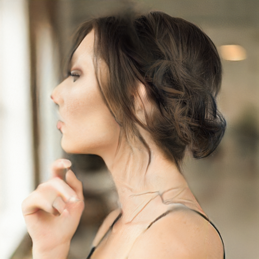
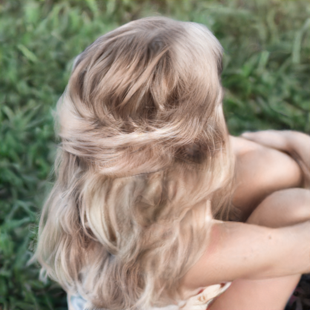

### sketchhairsalon / hairclipv2 / ours 비교

| 원본 | sketch | SketchHairSalon | HairClipV2 | Ours|
|:----:|:------:|:---------------:|:----------:|:----------:|
|  |  |  |  |  |
|  |  |  |  |  |
|  |  |  |  |  |
|  |  |  |  |  |
|  |  |  |  |  |
|  |  |  |  |  |
|  |  |  |  |  |
|  |  |  |  |  |

### 정량 평가

| Metric | SketchHairSalon | HairClipV2 | Ours |
|:---|---:|---:|---:|
| PSNR_bg (↑) | **46.02 ± 1.22** | 24.06 ± 3.15 | 30.88 ± 3.65 |
| SSIM_bg (↑) | **0.9004 ± 0.0383** | 0.6483 ± 0.1042 | 0.8608 ± 0.0593 |
| SSIM_hair (↑) | 0.6059 ± 0.1149 | 0.3426 ± 0.1568 | **0.7450 ± 0.1192** |
| LPIPS_hair (↓) | 0.0866 ± 0.0302 | 0.0757 ± 0.0261 | **0.0256 ± 0.0155** |
| Boundary SSIM (↑) | **0.9004 ± 0.0383** | 0.6483 ± 0.1042 | 0.8608 ± 0.0593 |
| Boundary LPIPS (↓) | 0.0245 ± 0.0086 | 0.0467 ± 0.0181 | **0.0097 ± 0.0038** |
| Edge IoU (↑) | **0.0786 ± 0.0115** | 0.0551 ± 0.0103 | 0.0778 ± 0.0110 |
| Chamfer Dist (↓) | **5.84 ± 1.14** | 7.85 ± 2.04 | 6.01 ± 1.16 |
| ArcFace Cos (↑) | **0.9941 ± 0.0029** | 0.8098 ± 0.0869 | 0.9817 ± 0.0125 |
| FID hair (↓) | 234.22 | 287.28 | **85.75** |
| FID boundary (↓) | 54.54 | 72.57 | **12.51** |

### 결과 분석

#### 1. FID (Fréchet Inception Distance) ↓

**무엇을 측정하나:** InceptionV3로 추출한 이미지 feature 분포를 실제 데이터셋 분포와 비교하는 지표. 두 분포 간의 Fréchet(Wasserstein-2) 거리로, **낮을수록 생성 이미지의 분포가 실제에 가깝다**. 단일 이미지 비교가 아니라 전체 샘플 집합의 분포 차이를 측정하므로 생성 모델의 전반적 품질 및 다양성을 종합적으로 반영한다.

- **FID hair:** Ours **85.75** vs SketchHairSalon 234.22 vs HairClipV2 287.28 → 약 2.7~3.4배 낮음. 헤어 영역에서 생성된 텍스처,형태의 분포가 실제 데이터와 가장 유사함을 의미한다. (색깔 영향 있을 듯)
- **FID boundary:** Ours **12.51** vs SketchHairSalon 54.54 vs HairClipV2 72.57 → 약 4~6배 낮음. 헤어-배경 경계에서 압도적 우위를 보인다.

#### 2. LPIPS (Learned Perceptual Image Patch Similarity) ↓

**무엇을 측정하나:** VGG 네트워크의 중간 feature map 간 거리로 인간의 시각적 인지와 유사한 지각적 유사도를 측정. 픽셀 단위 비교(PSNR, SSIM)와 달리 텍스처·스타일 차이에 민감하며, 낮을수록 지각적으로 GT에 가깝다.

- **LPIPS_hair:** Ours **0.0256** vs SketchHairSalon 0.0866 vs HairClipV2 0.0757 → 약 3배 낮음. 헤어 텍스처가 GT와 지각적으로 가장 유사하다.(색깔 영향 있을 듯)
- **Boundary LPIPS:** Ours **0.0097** vs SketchHairSalon 0.0245 vs HairClipV2 0.0467 → 경계 처리의 정교함이 우수함을 의미

#### 3. SSIM (Structural Similarity Index) ↑

**무엇을 측정하나:** 밝기·대비·구조 세 요소를 분리해 측정하는 구조적 유사도 지표. **1에 가까울수록 GT와 구조적으로 유사**하다.

- **SSIM_bg:** SketchHairSalon **0.9004** > Ours 0.8608 > HairClipV2 0.6483. 배경 영역 구조 보존은 SketchHairSalon이 우위 (배경을 거의 그대로 복사하는 방식의 특성상 당연한 결과).
- **SSIM_hair:** Ours **0.7450** > SketchHairSalon 0.6059 > HairClipV2 0.3426. 헤어 영역 구조 유사도는 Ours가 가장 높음. GT 헤어와 구조적으로 더 충실하게 생성되고 있다.

#### 4. PSNR (Peak Signal-to-Noise Ratio) ↑

**무엇을 측정하나:** 픽셀 단위 MSE 기반 신호 대 잡음비(단위: dB). **높을수록 픽셀 수준에서 GT에 가깝다**. 텍스처 디테일보다 전체적인 밝기·색상 정확도에 민감하다.

- **PSNR_bg:** SketchHairSalon **46.02** >> Ours 30.88 > HairClipV2 24.06.Ours는 HairClipV2보다 약 6dB 높아 배경 보존 능력 자체는 양호하나, SketchHairSalon 대비 약 15dB 차이는 개선 가능성 확인이 필요함(Compositor ablation study 진행 예정)

#### 5. ArcFace Cosine Similarity ↑

**무엇을 측정하나:** ArcFace 얼굴 인식 모델로 추출한 embedding 간 코사인 유사도. **1에 가까울수록 헤어 변경 후에도 동일 인물로 인식**됨을 의미한다.

- Ours **0.9817** vs SketchHairSalon 0.9941 vs HairClipV2 0.8098. Ours는 SketchHairSalon과 0.012 차이로 매우 근접. HairClipV2 대비 약 0.17 높아, 헤어 변경 시 얼굴 identity를 가장 잘 보존함을 확인.

#### 6. Edge IoU & Chamfer Distance

**무엇을 측정하나:**
- **Edge IoU:** Canny edge(생성 이미지) ∩ sketch edge / union. 높을수록 sketch 윤곽을 충실히 따름.
- **Chamfer Distance:** 생성 edge ↔ sketch edge 간 양방향 최소거리 평균(px). 낮을수록 sketch에 가깝다.

- **Edge IoU:** SketchHairSalon **0.0786** ≈ Ours 0.0778 >> HairClipV2 0.0551. 전체적인 헤어 윤곽 충실도는 SketchHairSalon과 거의 동등.
- **Chamfer Dist:** SketchHairSalon **5.84** ≈ Ours 6.01 < HairClipV2 7.85. edge 간 거리 역시 유사한 수준.

→ **해석:** Ours는 sketch 기반 형태 제어 능력에서 SketchHairSalon과 대등하면서, 헤어 내부 텍스처 품질(LPIPS, FID, SSIM_hair)에서 압도적 우위를 보인다. 색 제어 확이 후 다시 해봐야 하지 않을까 싶긴하다....

#### 7. 약점: 배경 보존 (PSNR_bg / SSIM_bg) 

**PSNR_bg / SSIM_bg:** SketchHairSalon이 46.01 / 0.9004(거의 원본 유지)를 기록한 반면 Ours는 30.88 / 0.8608에 그침. HairClipV2(24.05 / 0.6483)보다는 낫지만, 배경의 구조적 무결성 유지 능력은 SketchHairSalon에 비해 현저히 떨어진다.

**원인 추정:** 헤어 스타일 변경 시 헤어 영역뿐만 아니라 배경 영역까지 불필요하게 수정하거나 아티팩트가 발생하고 있을 가능성이 큼. latent compositor의 배경 보존 메커니즘 점검 필요.(ablation 진행 해야할듯..)
